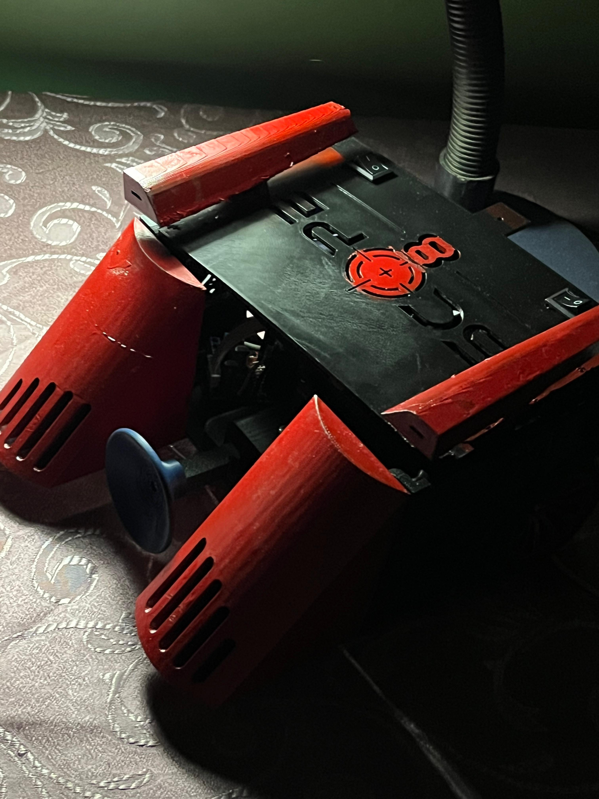
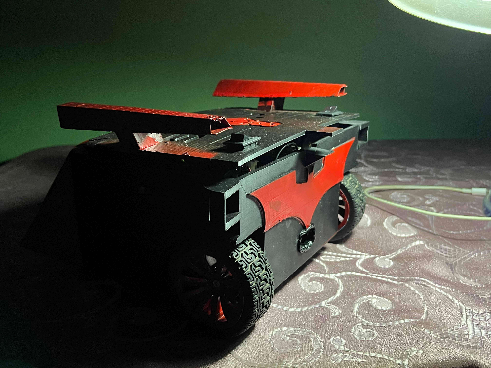
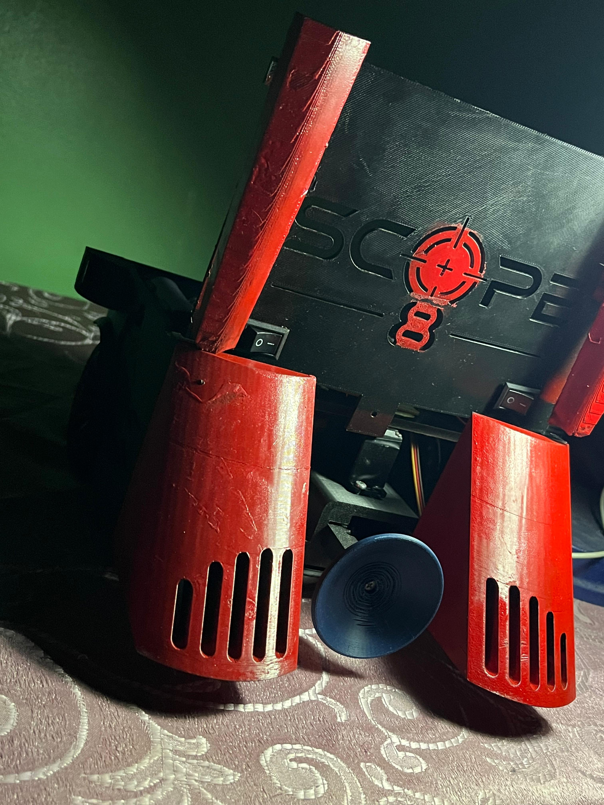
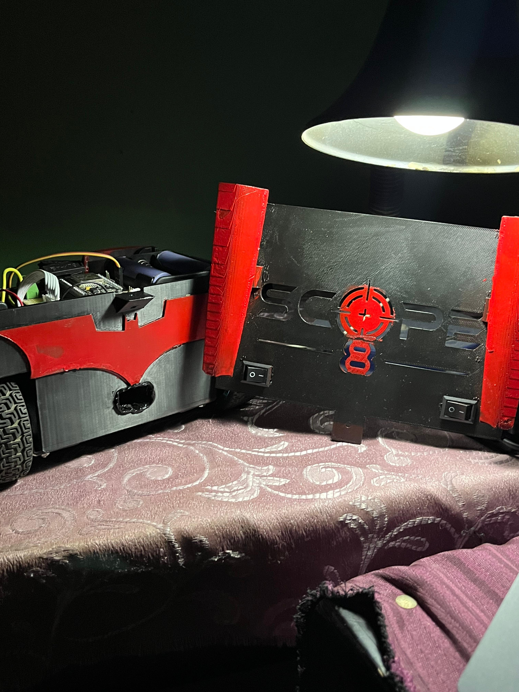
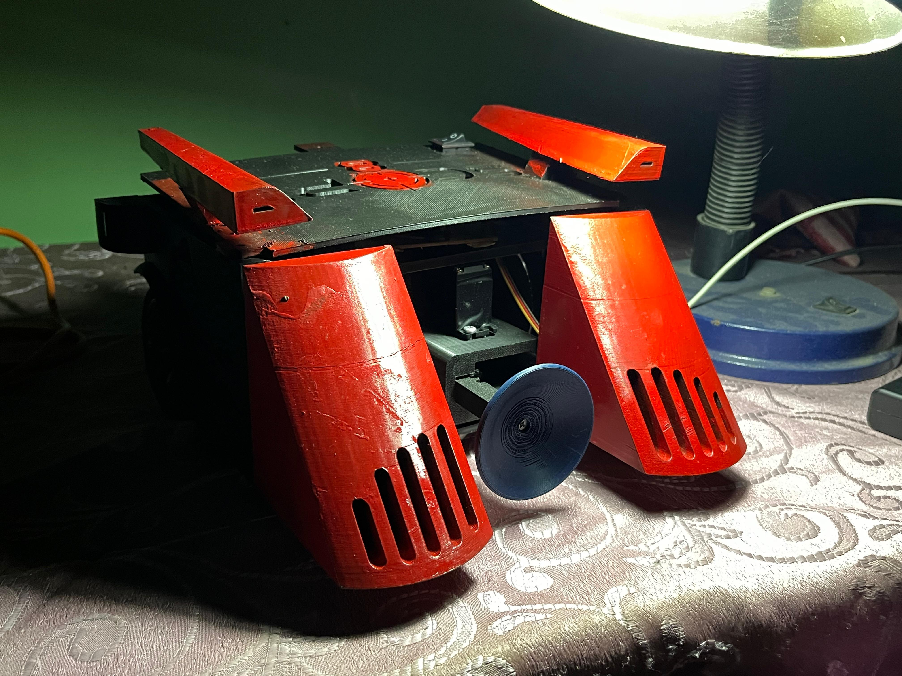
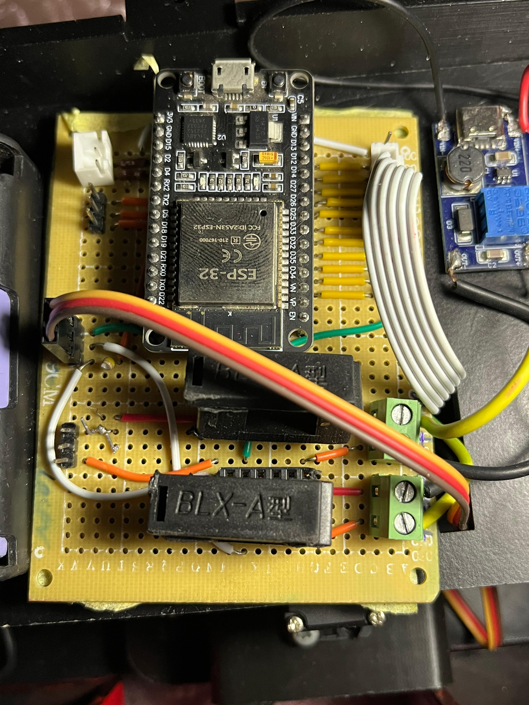
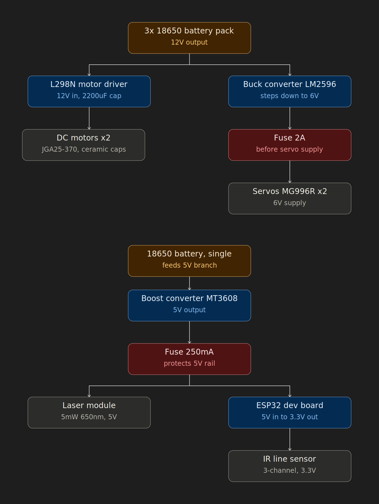

# Nightcrawler — Team Scope 8

Firmware for **Nightcrawler**, the robot built by **Team Scope 8** for the IEEE CUSB competition (🥇 1st place, 126/125 points). The robot competes in two stages — a line-following stage and a billiards stage — and switches live between autonomous and manual control.

Repository: https://github.com/engyousefmohsen/IEEE_Cairo

## Gallery

<table align="center">
  <tr>
    <td></td>
    <td></td>
  </tr>
  <tr>
    <td></td>
    <td></td>
  </tr>
  <tr>
    <td></td>
    <td></td>
  </tr>
</table>

## Overview

- **Modes:** Autonomous (PID line following) and Manual (PS5 controller), toggled on the fly with the Triangle button.
- **Autonomous stage:** 3-channel IR PID line follower with a checkpoint stop/clear routine for black-strap markers.
- **Billiards stage:** A servo-driven cue/impulse mechanism, actuated with the Cross button, launches the ball.
- **Manual drive:** PS5 left stick controls differential steering with deadzone filtering.

## Repository structure

```
FinalCode/Nightcrawler/     Final competition firmware (modular)
├── Nightcrawler.ino        Main entry point, mode switching between AUTONOMOUS / MANUAL
├── Config.h                Pin map, PWM config, PID tuning constants
├── Motors.h / Motors.ino   Differential drive control (L298N, LEDC PWM)
├── LineFollower.h / .ino   PID line follower + checkpoint state machine
└── CueMechanism.h / .ino   Servo-based cue mechanism for the billiards stage

Coding/                     Earlier standalone prototypes used during development
├── LineFollowing3/         Standalone line-follower prototype
├── MANUALMode/             Standalone PS5 manual-drive prototype
└── servoBill/              Standalone servo cue-mechanism prototype

cairoIeee/cairoIeee.ino     Earlier competition sketch iteration
calLinefollower.ino         Bluetooth-based line follower calibration/testing sketch
assets/                     Photos used in this README
```

The `FinalCode/Nightcrawler` folder is the version that competed. Everything under `Coding/` and the two root-level sketches are earlier prototypes kept for reference.

## Hardware

| Component | Part |
|---|---|
| Microcontroller | ESP32 dev board |
| Motor driver | L298N |
| Drive motors | 2x DC gear motor, 12V, 30 kg·cm |
| Cue mechanism servo | MG996R |
| Line sensor | 3-channel IR line tracker |
| Controller | PS5 DualSense (Bluetooth, `ps5Controller` library) |

**Power system:** two isolated rails. A 3x 18650 pack supplies 12V to the L298N/motors directly and to a buck converter (6V) for the servo, each with its own fuse. A separate single 18650 cell feeds a boost converter (5V) for the ESP32 and laser module, also fused, with the ESP32's onboard 3.3V rail powering the IR sensors.

<p align="center">
  
</p>

## Control logic

- **Autonomous:** PID constants (`Kp`, `Ki`, `Kd`) and base speed are tunable in `Config.h`. Detecting all three sensors on black triggers a checkpoint: the robot stops for 5 seconds, creeps forward to clear the strap, then resets the PID state to avoid a jerk on resume.
- **Manual:** Left stick maps to forward/steer intent with a deadzone; because the cue mechanism sits at the physical back of the chassis, the manual-mode kinematics are inverted so that "forward" always drives away from the cue side.
- **Mode switching:** Edge-triggered on the Triangle button — motors are stopped and the PID state is reset on every transition so no stale values carry over between modes.

## Requirements

- Arduino IDE with the ESP32 board package
- Libraries: `ps5Controller`, `ESP32Servo`

## Team

- **Electrical & Software:** Muhanad Mahfouz, Mohammed Hany
- **Mechanical:** Amr Khaled, Mohammed Hitham

## Result

🥇 1st place — IEEE CUSB competition — 126/125 points across the line-follower and billiards stages.
